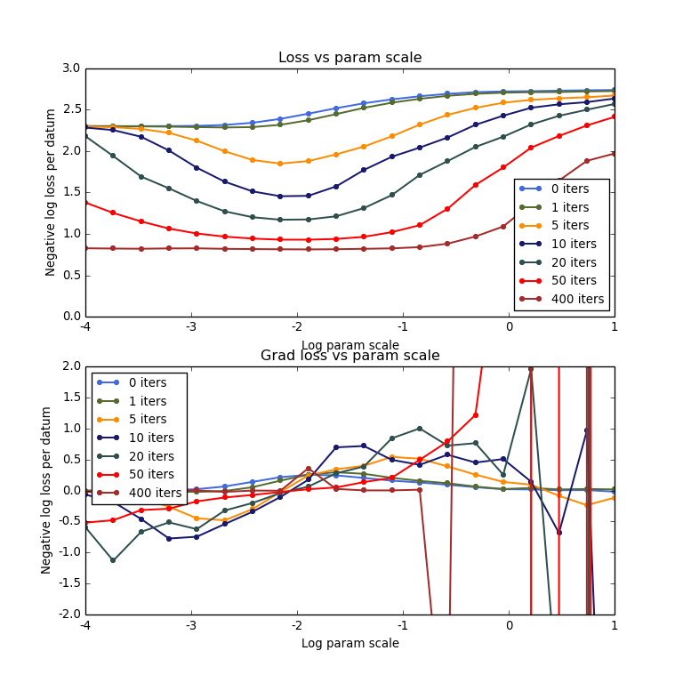

<!---  ./experiments/Jan_14_learning_rate_wiggliness/README.md --->
# Jan 14 experiment: learning rate wiggliness
Let's now look at the learning rate. As before...

Ok, similar story as with the parameter scale. There's an "edge of chaos" to the
right but before then the gradients look pretty sensible.

# Jan 11 planning

Experiments in mind:

* Trying not to stray into chaos, see if we can optimize the initial
  distribution of weights. Look at gradient wrt individual weights
  as a function of their magnitude.
* Optimize learning rate schedule.

Should probably do each of these for a few random seeds. Then we should think
about optimizing generalization.

<!---  ./experiments/Jan_9_param_scale_wiggliness/README.md --->
# Jan 9 experiment: param scale wiggliness

Investigating the wiggliness of the loss as a function of the scale of
the initial parameters.

The actual loss looks very smooth but the gradient still goes
crazy. It could be numerical instability or it could conceivably be
that the apparent smoothness goes away on a sufficiently small length
scale. Testing this would be hard because numerical error will also
make it look rough on a small length scale. I think you'd want to try
looking for smooth oscillations. There's a hint of this at the 10
iteration level. Let's look at this closer, from, say, -2 to 1....

Ok, I think it's pretty clear that the function gets wiggly. But maybe
we would be ok if we stayed on the peaceful side of chaos? Let's try
more iterations...

Very interesting. It really does look like the chaos chills right out
when the parameter scale is small enough.

