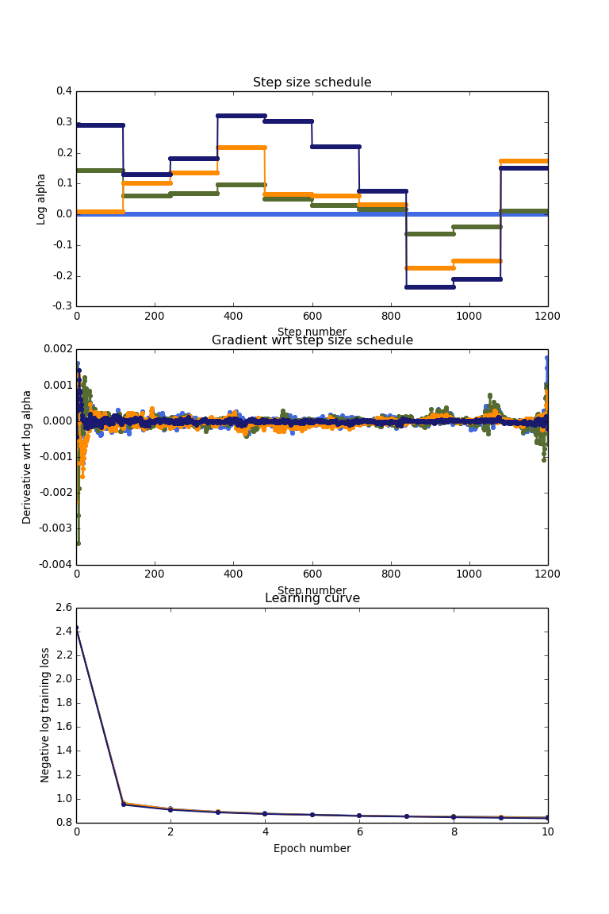
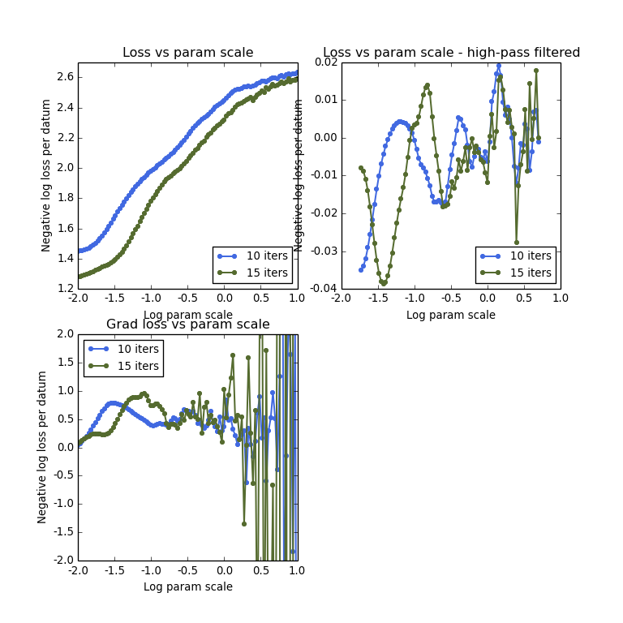

# Jan 16 experiment: trying to optimize initial weight disribution

We parameterized the initial weight distribution by a piecewise linear inverse
cdf. It seems feasible enough to learn a scale for the initial weight
distribution, but learning an actual shape seems trickier. Naive gradient
descent leads to a pathology where the inverse cdf becomes constant for
sections, corresponding to delta functions in the pdf.

# Jan 15 experiment: trying to optimize learning rate schedule

Since gradients wrt learning rate look sensible when they start low, let's try
now to actually optimize the schedule.

Some interesting features here. It improves at fist and then hits "chaos". The
gradients become oscillatory, so maybe the instability is only at high
frequencies? If that were true, we might just need some smoothing.

That was with a small data set (1k). Let's try with 3k.

Pretty crazy. But with minibatches of 250 that's not even a full epoch. Let's
try running for much longer, but average meta gradients over minibatches.

This is an interesting plot, but not quite what I expected. It hardly improves
the overall learning curve at all. Also interesting to note that the gradient is
much higher at the start and at the end. We also haf to use a very high meta
learning rate. Maybe it's not so surprising - the learning curve is very flat
towards the end, so gradients are necessarily going to be small.

<!---  ./experiments/Jan_14_learning_rate_wiggliness/README.md --->
# Jan 14 experiment: learning rate wiggliness
Let's now look at the learning rate. As before...

Ok, similar story as with the parameter scale. There's an "edge of chaos" to the
right but before then the gradients look pretty
sensible. [EDIT: Fixed image. The original showed the gradient wrt parameter scale.]

# Jan 11 planning

Experiments in mind:

* Trying not to stray into chaos, see if we can optimize the initial
  distribution of weights. Look at gradient wrt individual weights
  as a function of their magnitude.
* Optimize learning rate schedule.

Should probably do each of these for a few random seeds. Then we should think
about optimizing generalization.

<!---  ./experiments/Jan_9_param_scale_wiggliness/README.md --->
# Jan 9 experiment: param scale wiggliness

Investigating the wiggliness of the loss as a function of the scale of
the initial parameters.

The actual loss looks very smooth but the gradient still goes
crazy. It could be numerical instability or it could conceivably be
that the apparent smoothness goes away on a sufficiently small length
scale. Testing this would be hard because numerical error will also
make it look rough on a small length scale. I think you'd want to try
looking for smooth oscillations. There's a hint of this at the 10
iteration level. Let's look at this closer, from, say, -2 to 1....

Ok, I think it's pretty clear that the function gets wiggly. But maybe
we would be ok if we stayed on the peaceful side of chaos? Let's try
more iterations...

Very interesting. It really does look like the chaos chills right out
when the parameter scale is small enough.

