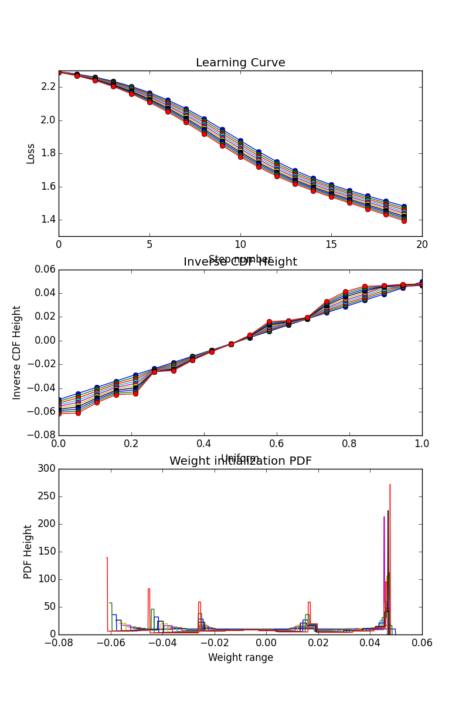
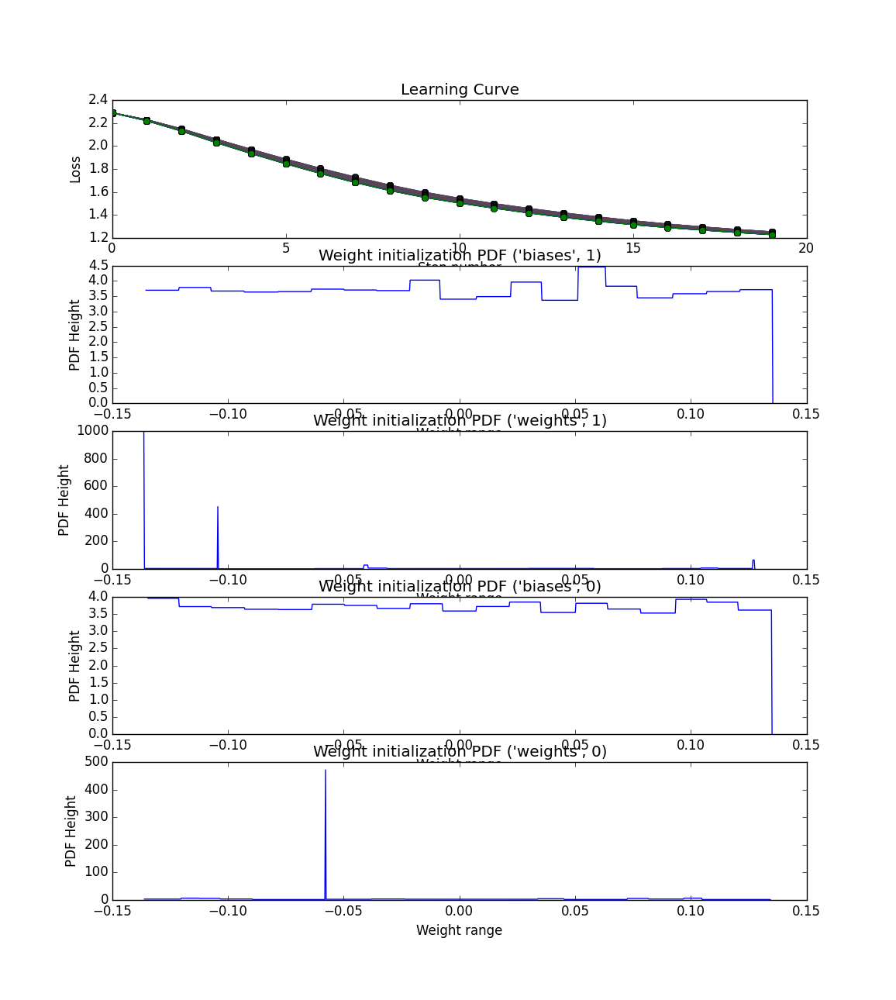
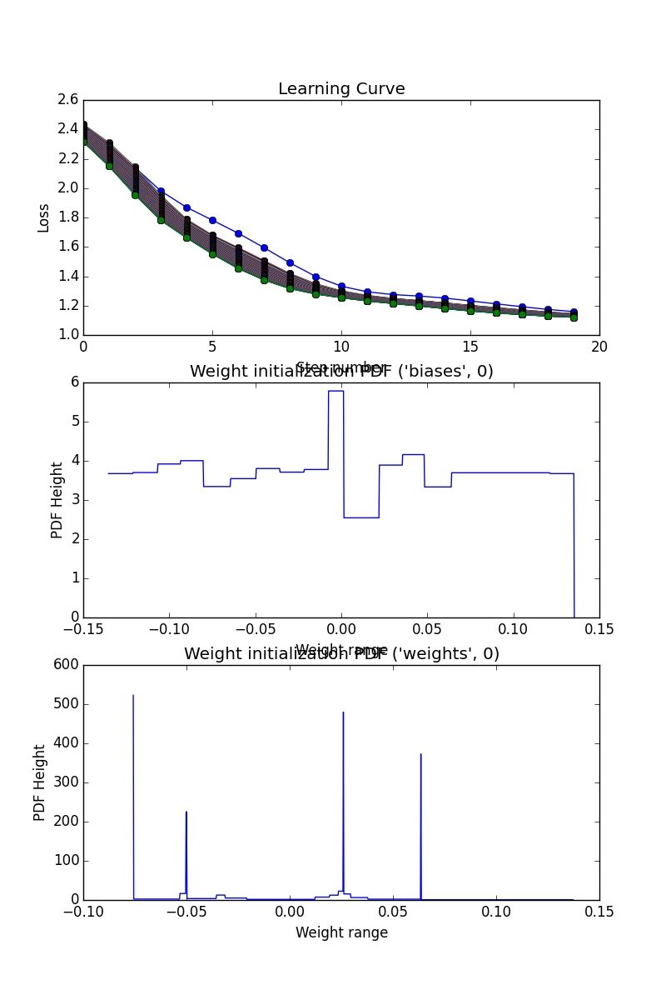
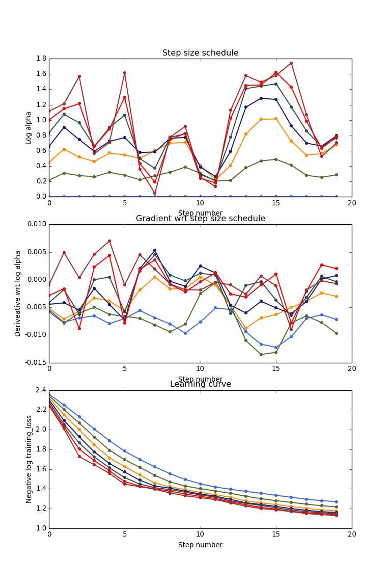

# Jan 19 experiment: Optimizing fake data

Given only 10 training examples, what should those examples look like in order to maximize the performance on a validation set?

The gradients of the cross-validation loss w.r.t. the individual pixels of the training data produce 'canonical examples' of each digit.

# Jan 16 experiment: Trying to optimize initial weight distributions

We'd like to say something about what the optimal weight distribution looks like.  However, it's tricky to sensibly set learning rates for the hyperparameters.

It looks like a few weights have much larger gradients than others (possibly the bias terms?).
To deal with this, we tried learning a separate initial distribution per layer:

It's not clear what's going wrong here - is it learning rates, or are the initial distributions way off?
The bias distributions will probably end up looking bad no matter what, since they have fewer weights than bins, but why do they look better than the filter parameter distributions?

I tried a simply experiment with only one layer and more meta-iterations:

When we zoom in, the distribution actually looks pretty sensible. Perhaps some of the spikes are artefacts, bins that have no data at all?  We can get around this by plotting the emperical histogram of weights instead of the distribution we learned.

# Jan 14 experiment: tryint to optimize learning rate schedule

Since gradients wrt learning rate look sensible when they start low, let's try
now to actually optimize the schedule.

Some interesting features here. It improves at fist and then hits "chaos". The
gradients become oscillatory, so maybe the instability is only at high
frequencies? If that were true, we might just need some smoothing.

That was with a small data set (1k). Let's try with 3k.

Pretty crazy. But with minibatches of 250 that's not even a full epoch. Let's
try running for much longer, but average meta gradients over minibatches.

<!---  ./experiments/Jan_14_learning_rate_wiggliness/README.md --->
# Jan 14 experiment: learning rate wiggliness
Let's now look at the learning rate. As before...

Ok, similar story as with the parameter scale. There's an "edge of chaos" to the
right but before then the gradients look pretty
sensible. [EDIT: Fixed image. The original showed the gradient wrt parameter scale.]

# Jan 11 planning

Experiments in mind:

* Trying not to stray into chaos, see if we can optimize the initial
  distribution of weights. Look at gradient wrt individual weights
  as a function of their magnitude.
* Optimize learning rate schedule.

Should probably do each of these for a few random seeds. Then we should think
about optimizing generalization.

<!---  ./experiments/Jan_9_param_scale_wiggliness/README.md --->
# Jan 9 experiment: param scale wiggliness

Investigating the wiggliness of the loss as a function of the scale of
the initial parameters.

The actual loss looks very smooth but the gradient still goes
crazy. It could be numerical instability or it could conceivably be
that the apparent smoothness goes away on a sufficiently small length
scale. Testing this would be hard because numerical error will also
make it look rough on a small length scale. I think you'd want to try
looking for smooth oscillations. There's a hint of this at the 10
iteration level. Let's look at this closer, from, say, -2 to 1....

Ok, I think it's pretty clear that the function gets wiggly. But maybe
we would be ok if we stayed on the peaceful side of chaos? Let's try
more iterations...

Very interesting. It really does look like the chaos chills right out
when the parameter scale is small enough.

